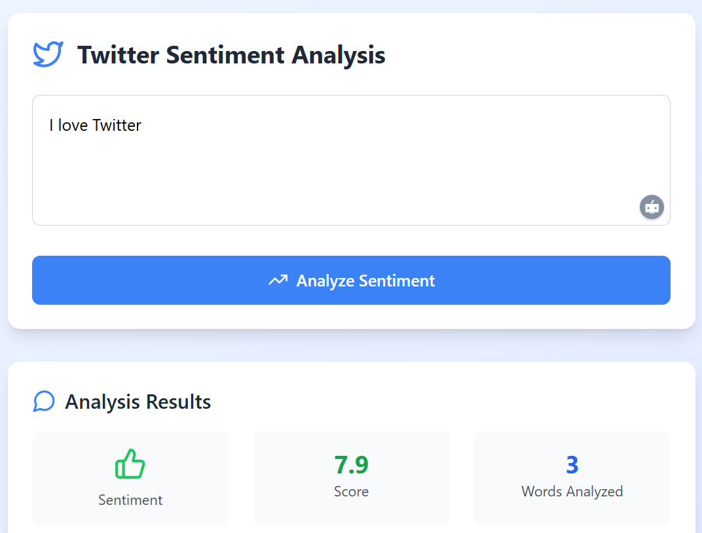

# Twitter Sentiment Analysis Project



A real-time sentiment analysis tool that combines deep learning and natural language processing to analyze the emotional tone of text input. The project uses a hybrid approach combining VADER sentiment analysis with a custom deep learning model for more accurate results.

## Features

- Real-time sentiment analysis
- Hybrid sentiment scoring (Deep Learning + VADER)
- Word-level sentiment breakdown
- Positive/Negative word highlighting
- Modern, responsive UI
- Interactive visualization of results

## Tech Stack

### Backend

- FastAPI
- TensorFlow/Keras
- NLTK
- VADER Sentiment
- TextBlob
- Python 3.8+

### Frontend

- React
- TypeScript
- Tailwind CSS
- Axios
- Lucide React Icons

## Prerequisites

- Python 3.8 or higher
- Node.js 14.0 or higher
- npm or yarn

## Installation

1. Clone the repository:

```bash
git clone https://github.com/yourusername/twitter-sentiment-analysis.git
cd twitter-sentiment-analysis
```

2. Set up the backend:

```bash
# Create and activate virtual environment
python -m venv tenv
.\tenv\Scripts\activate

# Install dependencies
pip install -r requirements.txt
```

3. Set up the frontend:

```bash
npm install
```

## Running the Application

1. Start the backend server:

```bash
cd server
uvicorn main:app --reload
```

2. Start the frontend development server (in a new terminal):

```bash
npm run dev
```

3. Access the application at `http://localhost:5173`

## Project Structure

```
twitter-sentiment-analysis/
├── server/
│   ├── main.py
│   └── models/
│       ├── full_model.h5
│       └── tokenizer.pkl
├── src/
│   ├── App.tsx
│   └── ...
├── package.json
└── README.md
```

## 🔍 API Endpoints

### POST `/analyze`

Analyzes the sentiment of provided text.

**Request Body:**

```json
{
  "text": "Your text to analyze"
}
```

**Response:**

```json
{
  "score": 0.75,
  "positive_words": ["good", "great"],
  "negative_words": ["bad"],
  "tokens": ["your", "text", "here"]
}
```

## Contributing

1. Fork the repository
2. Create your feature branch (`git checkout -b feature/AmazingFeature`)
3. Commit your changes (`git commit -m 'Add some AmazingFeature'`)
4. Push to the branch (`git push origin feature/AmazingFeature`)
5. Open a Pull Request

## License

This project is licensed under the MIT License - see the [LICENSE](LICENSE) file for details.

## Acknowledgments

- VADER Sentiment Analysis
- TensorFlow/Keras community
- FastAPI framework
- React and Tailwind CSS communities
